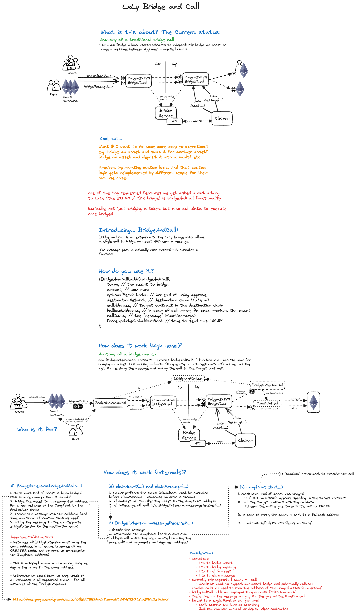

# uLXLY BRIDGE AND CALL

Bridge and Call contract for AggLayer's Unified Bridge. Allows bridging an asset w/ logic to be executed. Check the [Relevant Info section](https://github.com/AggLayer/lxly-bridge-and-call?tab=readme-ov-file#relevant-information).

## Deployments

Currently deployed to

- Ethereum Mainnet https://etherscan.io/address/0x64b20eb25aed030fd510ef93b9135278b152f6a6
- Polygon ZkEVM https://zkevm.polygonscan.com/address/0x64B20Eb25AEd030FD510EF93B9135278B152f6a6
- X Layer https://www.oklink.com/xlayer/address/0x64b20eb25aed030fd510ef93b9135278b152f6a6/contract
- Silicon https://scope.silicon.network/account/0x64b20eb25aed030fd510ef93b9135278b152f6a6
- Lumia https://explorer.lumia.org/address/0x64B20Eb25AEd030FD510EF93B9135278B152f6a6

more to come.

## Testing and Deploying

First, copy `.env.example` to `.env` and set the appropriate environment variables (annotated with TODOs).

### Testing (Mainnet Forks)

1. Start anvil: two instances required, one for L1, and one for L2

```bash
# 1.1 start L1 (ethereum mainnet) anvil - NOTE: using port 8001 for L1
anvil --fork-url=mainnet --chain-id 1 --port 8001 --fork-block-number 19370366

# 1.2 start L2 (polygon zkevm) anvil - NOTE: using port 8101 for L2
anvil --fork-url=polygon_zkevm --chain-id 1101 --port 8101 --fork-block-number 10484909
```

2. Run the tests

```bash
forge test -vvvvv
```

or

```
forge test -vvvvv --match-contract NativeConverter
forge test -vvvvv --match-contract QuickSwap
forge test -vvvvv --match-contract KEOM
```

NOTE: `testBridgeFromL2AndCallL1Uniswap` might fail due to exchange rates, if you're not forking the expected block number. You can manually change the expected exchange rate in `ZkEVM2ETHMainnet.t.sol#L124`.

### Deployment

**NOTE: BridgeExtension (proxy) must be deployed to the same address on all chains**

setup the `DEPLOYER_PRIVATE_KEY` and run

```
export RPC=yourRPCURL
forge script script/DeployInitBridgeAndCall.s.sol --rpc-url ${RPC} -vvvvv --legacy --broadcast
```

#### In case the script reports an error:

**No create2 deployer.**  

This means your chain doesn't have the keyless create2 deployer at: `0x4e59b44847b379578588920cA78FbF26c0B4956C`
The deployer is documented here: https://github.com/Arachnid/deterministic-deployment-proxy   
Because we get only one attempt at deploying this please be extra careful and first simulate the deployment:
```
forge script script/DeployUtils.s.sol --rpc-url ${RPC} -vvvvv --legacy
```
Make sure the deploy account has at least 0.2 eth as 0.1 will send to the keyless deployer account.  
You can deploy it using:

```
forge script script/DeployUtils.s.sol --rpc-url ${RPC} -vvvvv --legacy --broadcast
```

**Implementation not deployed correctly! or Proxy not deployed correctly!**

This likely means your local setup generated the wrong bytecode for the Proxy and Implementation contracts.  
This can happen for a variety of reasons. In the `scripts/artifacts` directory are the expected bytecodes.
As an alternative you can use:

```
forge script script/DirectDeployInitBridgeAndCall.s.sol --rpc-url ${RPC} -vvvvv --legacy --broadcast
```

It uses prepared tx data that uses the exact bytecode needed.

## Audit

https://github.com/agglayer/lxly-bridge-and-call/tree/main/audit

## Future Work

- create easier interfaces for bridging assets (gas token, lx weth, erc20)
- helper claimBridgeAndCall function
- ethers/viem example calling bridgeAndCall

## Relevant Information

- [Demos Repository](https://github.com/AggLayer/lxly-bridge-and-call-demos/)

- [Bridge Asset Scenarios](https://docs.google.com/spreadsheets/d/1lBktJ5HSGwVXTzxm-eWCVhPGJKF22YvM59VaQBGLHMY)


